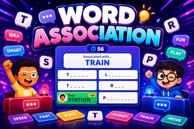
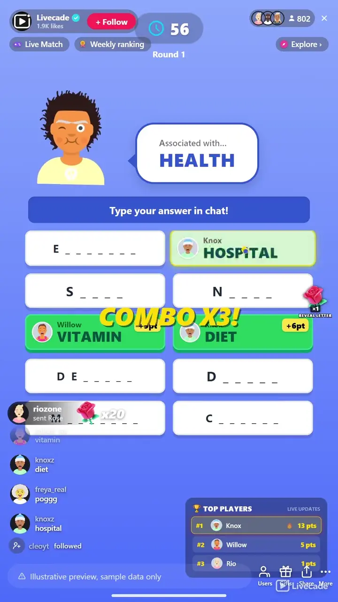

# Word Association - Interactive TikTok Live Game

> One prompt, a grid of associations, your chat races to fill them.

A fast word-association race for your whole chat. Each round shows one prompt and a grid of hidden slots, one per associated word. The first viewer to type a slot's word fills it and scores, chain fills for combos, and top the round for MVP.

**[Play Word Association on Livecade](https://livecade.io/games/word-association/?utm_source=github&utm_medium=readme&utm_campaign=word-association)** - runs as a single browser source in OBS, Streamlabs, or TikTok LIVE Studio. Nothing for viewers to install.

## How viewers play

Viewers take part with the actions TikTok already gives them: **comments**, **gifts**. Every action below is rebindable, so you decide which interaction drives which effect.

| Action | What it does |
| --- | --- |
| **Reveal a letter** | Uncovers one more letter of a random unfilled slot for everyone and credits the gifter, but never the last letter |

## How it works

### One prompt, a grid to fill

Each round shows a single prompt above a grid of hidden slots, one per associated word. Viewers race to be first to type each association in chat, and landing a word fills its slot and scores.

### Chain fills for combos

Faster fills and rapid back-to-back combo chains earn bonus points, so the room speeds up as it goes. The top scorer each round is crowned MVP.

### Gifts reveal a letter

A gift uncovers one more letter of a random unfilled slot and credits the gifter, but never the final letter. Gifts help the crowd along while every fill still has to be typed.

## About the game

Word Association turns your chat into a rapid-fire brainstorm. Each round flashes a single prompt, say OCEAN, above a grid of hidden slots, one slot per associated word, and viewers race to be first to type each association in chat.

### Speed and combos are worth more

Land a word and its slot fills and you score, with faster fills and rapid back-to-back combo chains earning bonus points. The top scorer each round is crowned MVP and read aloud.

### A gift helps the crowd, not the buyer

Gifts uncover one more letter of a random unfilled slot and credit the gifter, but never expose a slot's final letter, so every fill still has to be typed. Run rounds timed with an early finish when every slot is found, or play until all are found, and pick from twelve languages, each with its own native association bank of hundreds of prompts.

## What it looks like on stream

[Watch Word Association gameplay](https://cdn.livecade.io/games/word-association.mp4)

## What you can configure

- **Language** - Twelve languages, each with its own native association bank
- **Round mode** - Timed with an early finish when every slot is found, or play until all are found
- **Round time and break** - How long a timed round runs and the gap before the next prompt
- **Scoring, speed bonus, and combos** - Base points per word, a bonus for faster fills, and combo points for quick back-to-back fills
- **Limit guesses per viewer** - Optionally cap how many guesses each viewer gets per round
- **Leaderboards** - Show a this-round board and a session board, and how many entries
- **Mascot and read MVP aloud** - Show the on-screen mascot and announce the round MVP via text-to-speech
- **Background** - A solid color, or your own image or GIF

## Languages

English, Spanish, Portuguese, French, German, Italian, Indonesian, Arabic, Turkish, Russian, Hindi, Romanian

## FAQ

<strong>How do viewers play Word Association?</strong>

Each round shows a prompt above a grid of hidden slots, one per associated word. Viewers type associations in your TikTok Live chat, and the first to type a slot's word fills it and scores, with the top scorer crowned MVP.

<strong>Do viewers need to send gifts to play?</strong>

No. Playing is free and comment-driven. Gifts uncover one more letter of a random unfilled slot to help the crowd, but never the final letter, so gifting helps without ever buying a fill outright.

<strong>What languages does it support?</strong>

Twelve languages, and each one has its own native association bank of hundreds of prompts rather than a translation of an English list. Viewers play in whichever language you set for the show.

<strong>How do I add Word Association to my TikTok Live?</strong>

Add one browser source URL to OBS or your streaming software and go live. There is no plugin to install and nothing for your viewers to download.

## Setup

1. [Create a Livecade account](https://app.livecade.io/register?utm_source=github&utm_medium=cta&utm_campaign=word-association)
2. Copy your overlay browser source URL
3. Paste it into OBS, Streamlabs, or TikTok LIVE Studio
4. Pick Word Association, set your triggers, and go live

Runs in the browser, so it works on Windows and macOS with nothing to download. [See all TikTok Live games](https://livecade.io/tiktok-live-games/?utm_source=github&utm_medium=readme&utm_campaign=word-association).

---

_This repository documents Word Association, a hosted interactive game by [Livecade](https://livecade.io/?utm_source=github&utm_medium=footer&utm_campaign=word-association). The game runs on Livecade's platform, so there is no source to install here._
